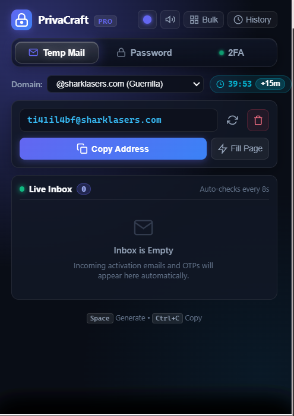
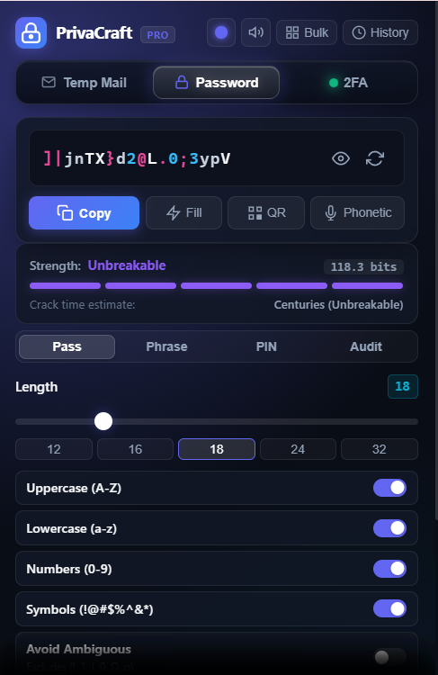
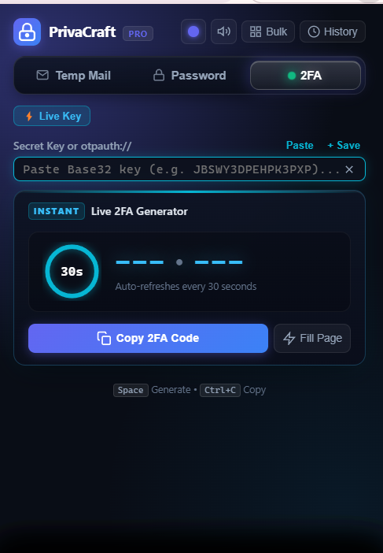

# PrivaCraft — Temp Mail, 2FA Vault & Password Studio

[](https://developer.chrome.com/docs/extensions/mv3/intro/)
[](LICENSE)
[](PRIVACY_POLICY.md)
[]()
[](privacraft-android/)

**PrivaCraft** is a modern, privacy-first open-source Chrome extension combining three essential cybersecurity tools into an ultra-fast, zero-bloat browser popup:

1. ✉️ **Disposable Temp Mail** with real-time inboxes and instant OTP code extraction.
2. ⚡ **2FA Live Cyber Authenticator** with animated circular countdown ring and local vault.
3. 🔐 **Cryptographic Password Studio** with session persistence, entropy analysis, and a **10-item copied passwords list**.
---

## 📸 Interface Preview

<div align="center">

| ✉️ Disposable Temp Mail | 🔐 Password Studio & Copied List | ⚡ 2FA Live Authenticator |
|:---:|:---:|:---:|
|  |  |  |
| *10+ Free Domains, Live Inbox & OTP Extractor* | *CSPRNG Generator & Copied Passwords List* | *RFC 6238 TOTP Engine & Cyber Countdown* |

</div>

---

## 🌟 Key Features

### 1. Disposable Temporary Email (Default View)
- **10+ Free Domains**: Switch seamlessly across GuerrillaMail (`@sharklasers.com`, `@guerrillamail.com`, `@grr.la`, `@pokemail.net`, `@spam4.me`) and Mail.tm (`@uberip.com`).
- **Survival Countdown Timer**: Live `MM:SS` timer showing mailbox lifespan with a **`+15m`** quick extension button.
- **Smart OTP & Link Extractor**: Scans incoming verification emails and displays a dedicated **"Copy Verification Code"** banner and direct link button.
- **1-Click Webpage Autofill**: Injects your temporary email address straight into active web sign-up inputs.
- **Clean Mailbox Destruction**: Discarding or changing domains triggers server-side deletion (`del_email` and `DELETE /accounts/{id}`) to eliminate ghost inboxes.

### 2. Futuristic 2FA Live Authenticator
- **Replaces Insecure Web Tools**: Eliminate the security risk of pasting 2FA seeds into public third-party sites like `2fa.live` or `2fa.cn`.
- **Animated Circular Ring**: Dynamic SVG countdown ring with color warning transitions (Cyan &rarr; Amber &rarr; Pulsing Red).
- **Cyber Split Code Display**: High-visibility split 6-digit display (e.g. `[482] • [910]`).
- **Encrypted Local Vault**: Save frequently used keys (GitHub, Google, Binance, Discord) for 1-click access.
- **1-Click Autofill**: Automatically fills 6-digit 2FA codes into active login fields.
- **100% Offline Computation**: RFC 6238 Web Crypto HMAC-SHA1 engine with zero network calls.

### 3. Password Studio & Auditor
- **CSPRNG Strength**: Built on `window.crypto.getRandomValues()` with uniform distribution.
- **Session Persistence**: Generated passwords persist across extension popup closes and tab switches—they will **never** randomly re-roll unless you request it.
- **Recent Copied Passwords List (Past 10 FIFO)**:
  - Automatically records copied passwords directly below the generator.
  - Keeps your **past 10 copied passwords** (oldest drops when an 11th is copied).
  - 1-click reveal/hide eye toggle, 1-click re-copy, single item delete, and "Clear" button.
- **Memorable Passphrases & Numeric PINs**: Diceware dictionary phrases and banking PINs.
- **Real-Time Entropy Analytics**: Exact bits of entropy and GPU brute-force crack time estimates.
- **Password Auditor**: Interactive weakness checklist with a 1-click **"Fortify"** auto-fixer.
- **NATO Phonetic Spelling Guide**: Audio/voice breakdown for phone verification (e.g. `UPPER-Kilo • Nine • Hash • Mike`).
- **Wi-Fi QR Code Generator**: Generate offline QR codes to instantly share Wi-Fi credentials.

### 5. 📱 Native Android App (Jetpack Compose)
- A complete native Android mobile app version of PrivaCraft is included in [privacraft-android/](privacraft-android/)!
- Built with **Kotlin** and **Jetpack Compose** with matching glassmorphism dark theme, live OTP extraction, 30s circular countdown ring, and the 10-item copied passwords list.
- Ready to open, build, and deploy directly in **Android Studio**.

### 4. Zero-RAM Footprint & Responsive Design
- **Zero-RAM Architecture**: Background polling and timers sleep when the popup is closed, using lightweight Manifest V3 alarms and offscreen audio when needed.
- **Mobile & Tablet Optimized**: Runs cleanly on desktop Chrome (390px baseline), mobile extension browsers (Kiwi, Orion, Android/iOS), and full tablet screens.
- **6 Dynamic Theme Accents**: Choose between Indigo, Emerald, Violet, Amber, Cyan, and Rose.

---

## 🚀 How to Install from Source (Developer Mode)

You can load PrivaCraft into any Chromium browser (Google Chrome, Microsoft Edge, Brave, Opera, Kiwi Browser):

1. **Clone or download this repository**:
   ```bash
   git clone https://github.com/YOUR_USERNAME/privacraft.git
   ```
2. Open your browser and navigate to:
   ```
   chrome://extensions
   ```
3. Enable **Developer mode** using the toggle switch in the top-right corner.
4. Click the **"Load unpacked"** button in the top-left corner.
5. Select the `privacraft` project folder containing `manifest.json`.
6. Click the extension puzzle icon in your browser toolbar and pin **PrivaCraft** for instant access!

---

## 📦 Packaging for Chrome Web Store

To build the clean, production-ready `.zip` package for the Chrome Web Store:

```bash
python package_extension.py
```

This generates `privacraft-v1.0.0.zip` (excluding git, tests, and documentation files) ready to upload to the [Chrome Developer Dashboard](https://chrome.google.com/webstore/devconsole).

---

## 🔒 Security & Privacy Model

- **No Remote Servers**: PrivaCraft has no tracking servers, no telemetry, and no accounts.
- **Local Storage Sandbox**: Settings, 2FA accounts, and password history are stored exclusively on your device via `chrome.storage.local`.
- **Strict Content Security Policy**: Zero inline scripts, zero `eval()`, and zero external code injection.
- Read our full [Privacy Policy](PRIVACY_POLICY.md).

---

## 📁 Repository Structure

```
├── manifest.json            # Manifest V3 extension configuration
├── popup.html               # Main UI popup & 3-option navigation dock
├── offscreen.html           # Offscreen document for Web Audio chimes
├── styles/
│   └── popup.css            # Dark glassmorphism & responsive CSS
├── scripts/
│   ├── generator.js         # CSPRNG password & Diceware engine
│   ├── strength.js          # Entropy analytics, crack times & fortifier
│   ├── totp.js              # RFC 6238 TOTP Web Crypto engine
│   ├── tempmail.js          # Multi-provider Temp Mail engine
│   ├── background.js        # Background alarms & notification service worker
│   ├── offscreen.js         # Synthesized Web Audio chime player
│   ├── storage.js           # Local persistence (past 10 copied passwords, 2FA vault)
│   ├── popup.js             # Controller, animations & webpage autofill
│   ├── qr.js                # Offline SVG QR generator
│   ├── phonetic.js          # NATO phonetic dictionary
│   └── audio.js             # Web Audio sound effects
├── icons/                   # High-res extension icons (16px, 48px, 128px)
├── CHROMEWEBSTORE.md        # Chrome Web Store submission copy & permissions
├── PRIVACY_POLICY.md        # Official privacy policy
├── LICENSE                  # MIT License
└── package_extension.py     # Automated store packager script
```

---

## 📄 License

This project is open source and available under the [MIT License](LICENSE).\n